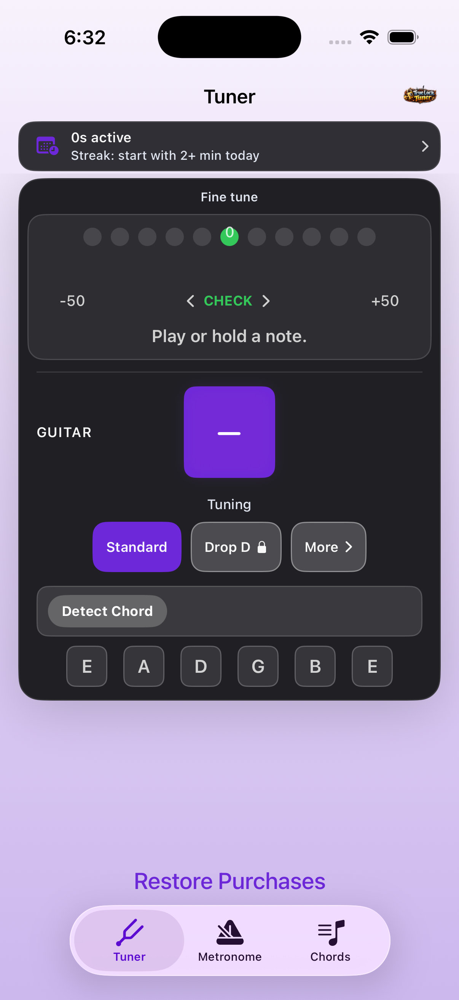
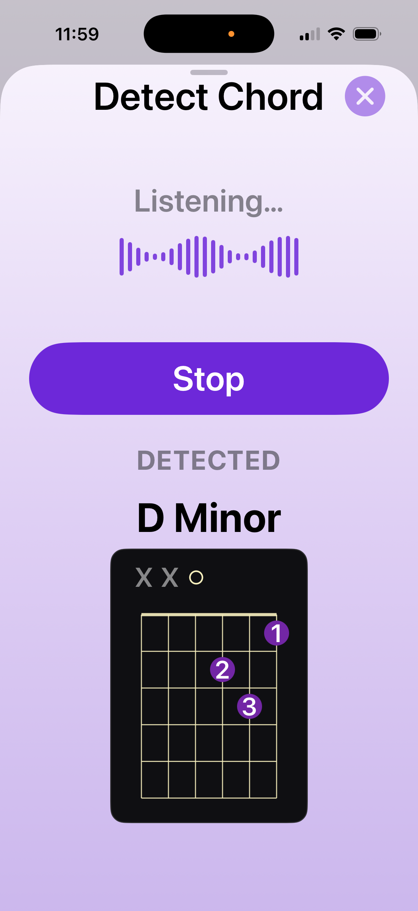
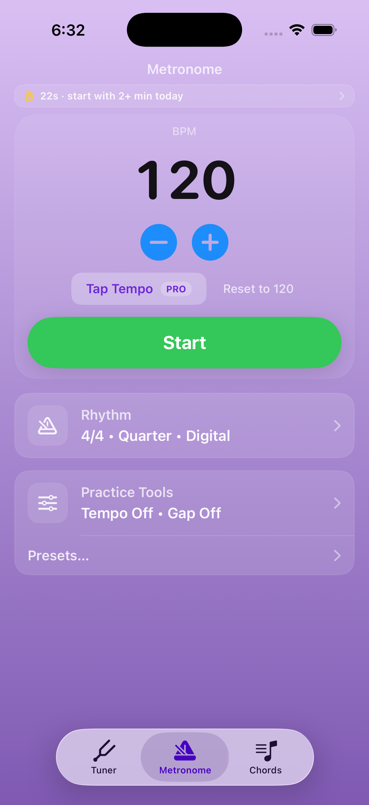

# True Lock Tuner — Engineering Case Study

True Lock Tuner is a production native iOS application for guitar tuning, chord recognition, metronome practice, and musical development.

I designed, built, shipped, and continue to maintain the application using Swift, SwiftUI, AVFoundation, StoreKit 2, and other Apple frameworks.

**Available on the App Store:**
[True Lock Tuner](https://apps.apple.com/us/app/guitar-tuner-true-lock-tuner/id6761863778)

**Full portfolio case study:**
[True Lock Tuner Engineering Case Study](https://gregory-swan-portfolio.netlify.app/project1)

## App Screenshots

| Tuner | Detect Chord | Metronome |
|:---:|:---:|:---:|
|  |  |  |

[View the detailed architecture overview](Architecture/architecture-overview.md)

## Engineering Focus

True Lock Tuner combines real-time audio processing with a state-driven SwiftUI interface and multiple interactive practice tools.

Key engineering areas include:

* Real-time microphone audio processing
* Pitch detection and tuning feedback
* Live chord recognition
* State-driven SwiftUI architecture
* Configurable metronome workflows
* Alternate guitar tunings
* StoreKit 2 purchasing and entitlement management
* Privacy-focused product analytics
* Simulator and physical-device testing
* App Store release and post-launch maintenance

---

## Real-Time Audio Processing

The core tuner continuously processes microphone input and converts raw audio measurements into responsive tuning feedback.

A key challenge is balancing sensitivity with interface stability. Incoming pitch data can fluctuate because of background noise, harmonics, playing technique, and microphone conditions.

The application processes and stabilizes those measurements before presenting tuning information to the user, allowing the interface to remain responsive without reacting excessively to noisy input.

The same microphone-driven architecture also supports live chord recognition.

---

## Product Architecture

True Lock Tuner is structured as a collection of independent but coordinated tools, including:

* Guitar tuner
* Live chord detection
* Metronome
* Tempo Trainer
* Gap Click practice mode
* Chord library
* Alternate tunings
* Practice tracking
* Premium feature management

The application uses reusable SwiftUI components and state-driven workflows so individual features can evolve without requiring large changes throughout the rest of the application.

---

## Monetization

True Lock Tuner uses a one-time Pro upgrade.

The purchase system includes:

* StoreKit 2 integration
* Entitlement handling
* Purchase restoration
* Free and premium feature states
* Premium feature gating

Purchase behavior is tested independently from the primary application features before production releases.

---

## Testing & Release

Testing includes both the iOS Simulator and physical iPhone hardware.

Physical-device testing is particularly important for:

* Microphone input
* Audio behavior
* Pitch detection
* Chord recognition
* StoreKit purchases
* Haptic feedback
* Device-specific interaction

I also manage the full App Store release lifecycle, including build validation, StoreKit testing, App Store Connect configuration, privacy disclosures, App Review submission, release management, and post-launch updates.

---

## Post-Launch Development

True Lock Tuner continues to evolve after release.

Product analytics and real-world usage help guide feature development and interface improvements while maintaining the stability of the production application.

Post-launch development has included expanded alternate tunings, new practice tools, improvements to chord recognition workflows, interface refinements, and App Store optimization.

---

## Technology

**iOS:** Swift, SwiftUI, Xcode
**Audio:** AVFoundation
**Purchases:** StoreKit 2
**Analytics:** TelemetryDeck
**Development:** Git, GitHub, physical-device testing
**Distribution:** App Store Connect, TestFlight, App Review

---

## About This Repository

The production True Lock Tuner source repository is private.

This public repository is a curated engineering showcase containing technical documentation, architecture discussions, screenshots, and selected sanitized implementation examples.

It is intended to demonstrate my approach to production iOS development without exposing the complete commercial application source code.

---

## Links

[View True Lock Tuner on the App Store](https://apps.apple.com/us/app/guitar-tuner-true-lock-tuner/id6761863778)

[View the Full Portfolio Case Study](https://gregory-swan-portfolio.netlify.app/project1)

[View My iOS Engineering Portfolio](https://gregory-swan-portfolio.netlify.app/)
